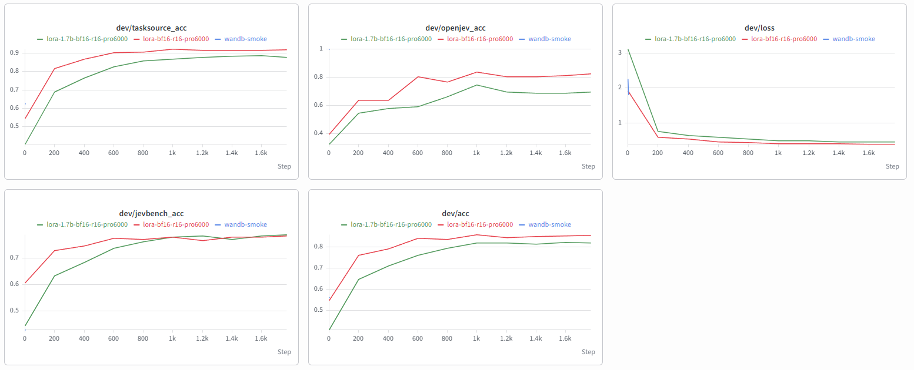

# Rizzo Flow

Decisioni tipizzate e stime numeriche locali con **XHToken/Spark-X2.5-4B**.
Il modello valuta le opzioni; il software restituisce JSON verificabile senza generare token.

Implementazione indipendente ispirata al pattern di Jev e SemIf. Usa Spark con un nostro
fine-tuning LoRA per le decisioni tipizzate (sezione [Fine-tuning](#fine-tuning); i pesi originali
restano a un flag di distanza, `--weights base`): non è un modello addestrato da zero, non replica
l'architettura proprietaria di Jev e non presume di avere probabilità calibrate o qualità superiore
a SemIf.

**Runtime: [llama.cpp](https://github.com/ggml-org/llama.cpp)** (dal 22 settembre 2026), quindi
GPU Apple, NVIDIA, AMD e Intel oppure sola CPU, senza compilare nulla. MLX, il runtime originale
del progetto, resta disponibile con `--backend mlx`. Verificato con i pesi reali su Windows 10 +
RTX 5060 Ti (build CUDA e build Vulkan): 65 test superati, API funzionante, smoke Q8_0 0.95 con
66 ms di mediana. Segnalazioni pubbliche descrivono anche prove su Mac M3 Pro/Metal, Radeon 780M e
Intel Iris Xe/Vulkan, oltre alla modalità CPU su un portatile Intel; non sono state riprodotte dai
manutentori ([#5](https://github.com/Rizzo-AI-Academy/rizzo-flow/issues/5), [#7](https://github.com/Rizzo-AI-Academy/rizzo-flow/issues/7), [#11](https://github.com/Rizzo-AI-Academy/rizzo-flow/issues/11)). Risultati, errori e limiti sono in [results/README.md](../results/README.md).

## Avvio

Gli stessi comandi su ogni sistema:

```bash
uv sync --locked
source .venv/bin/activate         # macOS / Linux
.venv\Scripts\activate           # Windows
rizzo download                    # runtime llama.cpp per questa macchina + Rizzo Flow 4B Q8_0 (~4.4 GB)
rizzo devices                     # GPU viste dal runtime e quella scelta da `auto`
rizzo decide examples/ticket.json
rizzo decide examples/numeric.json
rizzo serve                       # --device auto|gpu|cpu|cuda|vulkan|metal|rocm|sycl, default auto
```

`rizzo download` sceglie da solo il pacchetto ufficiale di llama.cpp (release `b11081`, verificato
con sha256): Metal sui Mac Apple Silicon, CUDA se c'è un driver NVIDIA, altrimenti Vulkan, che
pilota GPU AMD, Intel e NVIDIA con il driver già installato e ripiega sulla CPU se non c'è una
GPU. `--runtime rocm|sycl|vulkan|cpu` forza un'altra build; più build possono convivere e
`--device vulkan` sceglie quale usare. `RIZZO_LLAMA_DIR` punta a una build propria, che deve
essere dello stesso commit (`161755f`) perché i binding ctypes ricalcano quell'header.

**Cosa è stato provato dal progetto:** Windows 10 + RTX 5060 Ti, build CUDA e build Vulkan sulla
stessa scheda (stesse risposte: 3 argmax diversi su 252). Segnalazioni pubbliche riportano un run
Mac M3 Pro/Metal, AMD Radeon 780M/Vulkan, Intel Iris Xe/Vulkan e una prova in modalità CPU su un
portatile Intel; sono riferite nei link sopra ma non riprodotte dai manutentori. Linux, ROCm, SYCL
e una macchina senza GPU dedicata restano da verificare.

I pesi predefiniti (`--weights flow`) sono il nostro fine-tuning, fuso nei pesi e convertito in
GGUF ([4B](https://huggingface.co/rizzoaiacademy/rizzo-flow),
[1.7B](https://huggingface.co/rizzoaiacademy/rizzo-flow-1.7b)): `--quant q8_0` (default, 4.4 GB),
`q4_k_m` (2.6 GB; sull'1.7B perde 5 punti) o `bf16` (8.2 GB). `--weights base` scarica invece i GGUF originali degli autori del modello
([4B](https://huggingface.co/XHToken/Spark-X2.5-4B-GGUF),
[1.7B](https://huggingface.co/XHToken/Spark-X2.5-1.7B-GGUF)). Tutto finisce in `models/`, fissato per commit e sha256; `--size 1.7b`
per il modello piccolo. L'ID servito dice quali pesi rispondono: `rizzo-flow-4b-q8_0` o
`rizzo-spark-x2.5-4b-q8_0`. La quantizzazione modifica le probabilità: confrontare i risultati sul proprio carico.
I comandi vanno eseguiti dalla radice del progetto. `--model /percorso/file.gguf` carica un altro
file (senza provenienza verificata: `gguf_source` resta `null` nei metadati).

Runtime MLX (facoltativo): `uv sync --locked --extra mlx` (Apple Silicon; `--extra cuda` per
NVIDIA, `--extra cpu` senza GPU), `rizzo download --backend mlx` (fine-tuning in safetensors, ~8 GB),
`rizzo serve --backend mlx --bits 8`. Anche MLX usa il fine-tuning, dal checkpoint safetensors
BF16 pubblicato negli stessi repository (pesi identici bit per bit al GGUF BF16; `--weights base`
per i pesi originali). BF16 è la sua precisione predefinita; `--bits 8` e `--bits 4`
quantizzano i pesi in memoria. Tutti i risultati contrassegnati "MLX" sono stati misurati così.

L'API mantiene un solo modello residente. Interfaccia interattiva: <http://127.0.0.1:8017/docs>.
Gli schemi completi sono in `request.schema.json` e `response.schema.json`; il server valida
sia le richieste sia le risposte. `rizzo schema --response` esporta lo schema dell'output.

```bash
curl http://127.0.0.1:8017/v1/decisions \
  -H 'Content-Type: application/json' \
  --data-binary @examples/ticket.json
```

`GET /health` restituisce stato e provenienza del modello. Il server ascolta soltanto su localhost
per impostazione predefinita; la distribuzione pubblica non è inclusa.

## Playground

Con il server avviato: <http://127.0.0.1:8017/playground>. Builder di domande noul/choice/score,
esempi pronti, editor JSON grezzo per entrambi gli endpoint, barre di probabilità, tempi
(round-trip, inferenza, prefill), token dello state in cache, numero di microbatch e comando cURL.
Pagina singola senza dipendenze esterne, servita dallo stesso processo.

## Demo Snake

Con il server avviato: <http://127.0.0.1:8017/snake>. Ogni mossa del serpente è una richiesta
`POST /v1/decisions` (una domanda `choice` con le mosse legali); le probabilità del modello
compaiono in tempo reale sulle celle candidate, con barre, logit, tempi e registro delle
decisioni. Zero token generati. **Registra GIF** cattura griglia e pannello delle decisioni
direttamente nella pagina (encoder GIF89a scritto a mano, nessuna dipendenza) e, quando la fermi,
salva il file nei download.

Si può scegliere cosa vede il modello. Con i *sensori per mossa* (contenuto della cella, distanza
dal cibo, celle libere raggiungibili: calcolati dal gioco, la scelta è del modello) Q8 su M4 Pro
gioca a circa 2 mosse/s (≈ 490 ms a decisione, ~300 token): in tre partite informali 10×10 ha
mangiato 12 e 7 cibi in 80 mosse senza morire e 22 cibi in 208 mosse prima di chiudersi senza
mosse sicure. Con la *sola griglia ASCII* è morto entro 26 e 13 mosse con 0 punti in due partite.
Sono poche partite, non un benchmark. Le opzioni vengono mescolate a ogni mossa per attenuare il
bias di posizione; la rete di sicurezza è facoltativa, spenta di default e segnata nel registro.

## API compatibile con TypeSafe

`POST /v1/systemone` e `GET /v1/models` seguono la forma pubblica documentata in
<https://docs.typesafe.ai/api>: stesso corpo (`state`, `model`, `questions`), stessi tipi
(`noul`, `choice`, `score` con `instructions` e `criteria`), stessa risposta (`model`, `answers`, `usage`).

```bash
curl http://127.0.0.1:8017/v1/systemone \
  -H 'Content-Type: application/json' \
  -d '{
    "state": "Help! My payouts have been failing for 3 days.",
    "model": "rizzo-latest",
    "questions": {
      "is_urgent": {"type": "noul", "instructions": "Does this convey urgency?"},
      "department": {"type": "choice", "instructions": "Which team should handle this?",
        "criteria": {"billing": "Payments, invoicing, refunds", "technical": "Bugs, outages", "sales": null}},
      "frustration": {"type": "score", "instructions": "How frustrated is the customer?",
        "criteria": ["Calm", "Frustrated", "Very angry"]}
    }
  }'
```

Un client scritto per l'API ospitata può puntare qui cambiando soltanto l'URL di base
(per gli SDK ufficiali: `TYPESAFE_BASE_URL=http://127.0.0.1:8017`). **Compatibile è l'interfaccia, non il modello:**

- `model` accetta `rizzo-latest`, l'ID locale (es. `rizzo-spark-x2.5-4b-q8`) e qualunque nome `jev-*`
  come alias di comodo. La risposta riporta sempre l'ID locale: nessuna risposta si presenta come Jev.
- Le domande sono tradotte nelle primitive native con `allow_abstain: false`, perché il formato
  non prevede astensione. `noul` è la probabilità di "sì" tra due sole opzioni.
- `confidence = (n × p_max − 1) / (n − 1)`, la statistica mostrata nella pagina Confidence di TypeSafe.
  La formula esatta di Jev non è pubblica. Descrive la forma della distribuzione: non è calibrata.
  Sul checkpoint Spark le distribuzioni sono spesso molto concentrate (0.9999): senza temperature
  scaling sul proprio dominio le soglie di confidence pensate per Jev non sono trasferibili.
- Limiti locali: 26 opzioni per `choice` (una per lettera; Jev: 255), 10 livelli per `score`, 64 domande,
  8000 caratteri per `instructions` e per ogni descrizione. `instructions`/`criteria` strutturati
  vengono serializzati come JSON canonico.
- `usage.input_tokens` conta lo state una volta sola più i suffissi; `output_tokens` è sempre 0.
- I campi ignoti al primo livello vengono ignorati, come fa l'API ospitata: gli SDK inoltrano
  quelli passati da chi chiama. Dentro una domanda restano un 422: un `criteria` scritto male
  non deve passare in silenzio.
- `x_rizzo` (tempi, fingerprint, stato delle probabilità) è un'estensione fuori dal contratto.
- Autenticazione Bearer come l'originale, attiva solo se è impostata `RIZZO_API_KEY`
  (altrimenti l'header è ignorato). Errori: 401, 422 e 400
  (`{"error_type": "api_usage_error"}`) per un nome di modello che questo server non serve.
  Nessun rate limit, quindi niente 429/529.

`/v1/decisions` resta l'API nativa completa: `numeric`, astensione, policy, logit e statistiche.

## Le quattro primitive

| Tipo | Input specifico | Output principale |
| --- | --- | --- |
| `boolean` | Descrizioni opzionali di vero e falso | `value` booleano e probabilità di vero condizionata alla disponibilità |
| `choice` | `options` con ID e descrizioni | `choice`, probabilità di ciascuna opzione |
| `score` | `levels` ordinati, da basso ad alto | Media dei livelli, `normalized_score`, dispersione |
| `numeric` | `anchors` crescenti con valore e descrizione, `unit` | Media delle ancore, mediana, dispersione, probabilità fuori scala |

Ogni richiesta contiene uno `state` (testo, oggetto o array) e un dizionario `questions`.
Gli ID delle domande non sono inviati al modello. Le descrizioni devono essere autonome.
Massimo 64 domande per richiesta. Ogni candidato, speciali inclusi, è una lettera maiuscola a token
singolo verificata con il tokenizer ufficiale: 26 slot in tutto. Quindi 26 opzioni o livelli con
`allow_abstain: false`, 25 con l'astensione (default); per `numeric` 24 ancore, 23 con l'astensione.

```json
{
  "state": {"measurement": 75, "unit": "percent"},
  "questions": {
    "fill": {
      "type": "numeric",
      "instructions": "Read the reported fill percentage.",
      "unit": "percent",
      "anchors": [
        {"value": 0, "description": "Empty"},
        {"value": 50, "description": "Half full"},
        {"value": 75, "description": "Three quarters full"},
        {"value": 100, "description": "Completely full"}
      ]
    }
  }
}
```

Esempi completi: `examples/ticket.json`, `examples/numeric.json`, `examples/house.json`.
I comparabili immobiliari dell'ultimo esempio sono **sintetici**, non quotazioni di mercato.

## Cosa significa un numero

`score = Σ indice × probabilità`; `numeric.value = Σ valore_ancora × probabilità`.
Quando esistono opzioni di astensione o fuori scala, queste medie sono condizionate alla
distribuzione sulle sole opzioni valide. La risposta espone anche la distribuzione originale
completa e la massa di probabilità esclusa, senza nasconderla.

Le ancore sono valori rappresentativi, **non intervalli statistici**. Se si vogliono usare fasce,
bisogna definirle in modo non sovrapposto nelle descrizioni e scegliere valori rappresentativi
appropriati. I quantili restituiti sono quantili della distribuzione discreta sulle ancore:
non sono intervalli di confidenza o garanzie di copertura sul valore reale.
Anche `stddev` misura soltanto la dispersione tra ancore: non include la variabilità interna a una fascia.
Molti decimali non equivalgono ad alta precisione; la media rimane entro le ancore estreme.

`numeric` aggiunge sempre le opzioni `__below_range__` e `__above_range__`.
Tutti i tipi aggiungono `__insufficient__` per impostazione predefinita.
Quando prevale un'opzione non utilizzabile, o la loro massa complessiva raggiunge il limite,
il risultato principale è `null`, con `status` esplicito:

- `ok`: risultato disponibile secondo la policy;
- `insufficient_evidence`: evidenza insufficiente;
- `out_of_range`: valore fuori dal supporto numerico;
- `uncertain`: probabilità massima sotto la soglia richiesta.

Ogni domanda può includere:

```json
"policy": {
  "allow_abstain": true,
  "max_unavailable_probability": 0.5,
  "min_top_probability": 0.0
}
```

Queste soglie sono regole operative configurabili, non soglie universali di affidabilità.
Un `status: ok` non garantisce correttezza. L'opzione "non so" può anch'essa essere scelta male.
`concentration`, entropia e probabilità massima descrivono la distribuzione, non la probabilità
che la decisione sia corretta. L'API nativa non espone alcuna `confidence`; quella dell'endpoint compatibile è dichiarata non calibrata.

## Come risparmia lavoro

1. Compila ogni domanda in una scelta tra token singoli, disabilitando il thinking nel template Spark.
2. Esegue il prefill dello stato comune una volta, a blocchi di 512 token.
3. Clona le cache native di attenzione completa e sliding-window per le domande indipendenti.
4. Raggruppa i suffissi per lunghezza in microbatch (default 4), con padding causale a destra.
5. Legge l'ultima posizione reale di ogni domanda e proietta soltanto le righe di vocabolario
   delle risposte ammesse, anche con pesi quantizzati.
6. Converte i logit in distribuzioni e output tipizzati in Python.

Nessun ciclo di generazione, parsing del testo prodotto o riparazione JSON. Restano necessari
prefill e calcolo dei suffissi: "zero token generati" non significa latenza zero.
Il numero di domande, la loro lunghezza e la dimensione del batch incidono sulla latenza.
La cache dello stato viene scartata alla fine della richiesta; non conserva evidenza tra utenti.
Le richieste concorrenti condividono un lock per evitare picchi di memoria e interferenze GPU.

`mode: "direct"` nella richiesta disattiva la condivisione come riferimento di verifica.
`--batch-size 1` riduce la memoria e mantiene il riuso del prefisso. `--ctx` (prima `--max-tokens`) cambia
il limite per domanda (default 8192); input oltre il limite vengono rifiutati, mai troncati.
Con llama.cpp la cache KV è prenotata all'avvio (`--ctx` + 2048 celle) e tiene tutte le posizioni
anche per i layer a finestra scorrevole: ~144 KiB per token nel 4B, circa 1.4 GiB con il default.
Con MLX il limite di cache inattiva è 256 MiB: non limita memoria dei pesi o cache KV attive.

## Fine-tuning

Un LoRA (r 16, alpha 32, tutti i layer lineari di attenzione e MLP) addestrato con lo stesso
forward pass dell'inferenza: nessun testo da generare, la loss è una cross-entropy morbida tra la
distribuzione attesa e il softmax sulle lettere di risposta, con i prompt esatti di
`spark-decisions-v3`. 28.321 domande da dataset pubblici (`tasksource/procedural-typed-decisions`,
`ZefanCai/Open-Jev` senza `customer-control-v1` e `workflow-controls-v1`, 12 config di
`Praveenrajus/jev-bench`), nessuna etichetta prodotta da Jev, esclusi gli stati che contengono testo
dei nostri set di valutazione. Un'epoca, 41 minuti (4B) e 19 minuti (1.7B) su una RTX PRO 6000.
Pipeline e scelte: [training.md](training.md).

<a href="../assets/training_charts.png"></a>

*Curve sul dev set (600 domande dagli split `validation` delle tre fonti, mai viste in training,
valutate ogni 200 step): rosso 4B, verde 1.7B. Sono numeri in distribuzione; la misura
indipendente è typed-decisions, sotto.*

<a href="../assets/training_charts.png"></a>

*Curve del dev da Weights & Biases: rosso = 4B, verde = 1.7B (il punto blu è una prova di 10
step). 600 domande degli split `validation` delle tre sorgenti, mai usate in training, valutate
allo step 0 e ogni 200 step; accuratezza = argmax contro argmax della distribuzione attesa. Sono
numeri nella stessa distribuzione del training: la misura indipendente è il benchmark qui sotto.*

Test di [`LocalLLaMA/typed-decisions`](https://huggingface.co/datasets/LocalLLaMA/typed-decisions)
(400 casi, 2.000 decisioni), base e fine-tuning sulla stessa macchina (llama.cpp CUDA, RTX 5060 Ti, Q8_0):

| | Accuracy | KL dal gold | Brier | ECE | p50 per caso |
| --- | ---: | ---: | ---: | ---: | ---: |
| Spark-X2.5-4B base | 0.574 | 2.899 | 0.480 | 0.349 | 201 ms |
| **Rizzo Flow 4B** | **0.648** | **0.452** | **0.205** | **0.112** | 195 ms |
| Spark-X2.5-1.7B base | 0.530 | 3.031 | 0.496 | 0.348 | 117 ms |
| Rizzo Flow 1.7B | 0.544 | 0.694 | 0.275 | 0.169 | 109 ms |
| Rizzo Flow 4B Q4_K_M | 0.650 | 0.436 | 0.201 | 0.093 | 198 ms |
| Rizzo Flow 1.7B Q4_K_M | 0.490 | 0.640 | 0.279 | 0.192 | 107 ms |
| Jev 1.13.0 (dalla scheda del dataset, non rimisurato) | 0.727 | 1.442 | 0.148 | – | – |

4B: +0.074 di accuracy, intervallo al 95% [+0.050, +0.101]; migliorano tutti e quattro i workflow.
1.7B: migliorano le probabilità ma non l'accuracy (+0.014 [−0.014, +0.043]) e `security_incidents`
scende da 0.612 a 0.514. Resta sotto Jev. Sulle fixture SemIf (4B Q8_0, escluse dal training): authored144
0.845 (SemIf Q8 0.819, pari: +0.027 [−0.038, +0.099]), perturbations108 0.946 (SemIf 0.766,
+0.180 [+0.108, +0.267]); peggiora però con evidenza mancante (0.583 contro 0.750 dei pesi base e
0.861 di SemIf, 5 scelte sicure sbagliate su 36). Lo smoke e l'1.7B sulle fixture SemIf non sono
ancora stati rimisurati: gli altri numeri di [results/README.md](../results/README.md) sono dei pesi originali.
Lo stesso fine-tuning gira anche con MLX (`--backend mlx`): pesi identici bit per bit al GGUF BF16,
e su MLX-CUDA il 4B dà stessi prompt e stesse probabilità di llama.cpp BF16 entro 0.001 (MLX non è
stato misurato sull'intero benchmark).

## Misurazioni e calibrazione

```bash
.venv/bin/pytest -q
.venv/bin/ruff check src tests scripts
.venv/bin/rizzo evaluate benchmarks/smoke.jsonl --compare-modes --output results/my-smoke.json
.venv/bin/rizzo evaluate benchmarks/perturbations.jsonl --output results/my-perturbations.json
.venv/bin/python scripts/validate_checkpoint.py --output results/my-q8-validation
RIZZO_REAL=1 .venv/bin/pytest -q -m integration   # runtime e pesi GGUF reali
```

Per confrontare due report per ID semantico:

```bash
.venv/bin/python scripts/compare_reports.py results/my-smoke.json results/my-perturbations.json --perturbations
```

I test del backend llama.cpp usano una sessione finta che registra ogni chiamata (posizioni,
sequenze, righe di logit lette); quelli del runtime verificano scelta del pacchetto, download
ripreso dopo un'interruzione, sha256 ed estrazione sicura senza rete. I test MLX (saltati se MLX
non è installato) usano l'architettura Spark reale con pesi casuali piccoli e verificano la proiezione
selettiva contro l'intero vocabolario, isolamento delle cache, confini sliding-window, batch con
lunghezze diverse e quantizzazione. Il validatore usa invece i pesi 4B reali, API, fixture e stato lungo.

Gli output sono **create-only**. I report conservano distribuzioni, logit, hash dei prompt,
hash dei pesi/tokenizer, revisioni, tempi sincronizzati GPU e memoria (`peak_device_bytes` con
llama.cpp: calo della memoria libera della GPU da prima del caricamento, quindi include gli altri
processi; `peak_mlx_bytes` con MLX). Il caricamento
e il warmup sono esclusi dai benchmark; tempi di compilazione e inferenza sono separati.
La memoria MLX non coincide con l'intera memoria del processo.

Le fixture incluse sono un piccolo smoke test scritto per il progetto, non un benchmark
indipendente né una prova di superiorità su Jev o SemIf. Le perturbazioni verificano cambi
di ordine e contesto irrilevante; vanno confrontate per ID semantico. Per il proprio dominio
servono dati con risposte note, un insieme di calibrazione separato e un test mai usato nel fitting.
La cronologia delle correzioni alle fixture è in `benchmarks/README.md`.

Temperature scaling è disponibile per ogni primitiva. Formato delle righe JSONL:

```json
{"type":"choice","logits":[1.0,3.0,-2.0],"label_index":1}
```

Usare i logit di **tutte** le opzioni, comprese quelle speciali, nello stesso ordine di `option_logits`.
Minimo 10 righe per tipo, solo come guardia tecnica: non basta per garantire qualità statistica.

```bash
.venv/bin/rizzo calibrate calibration.jsonl --fingerprint HASH_DEL_MODELLO --output calibration-fit.json
.venv/bin/rizzo evaluate held-out.jsonl --calibration calibration-fit.json --output results/held-out.json
```

Il fine-tuning migliora già la forma delle probabilità (ECE 0.349 → 0.112 sul 4B), ma non le
calibra sul vostro dominio: la temperature scaling resta il passo da fare prima di usare soglie.
Il fingerprint lega l'artefatto a pesi, tokenizer, precisione, runtime e versione del prompt:
una calibrazione fatta sui pesi originali non vale sul fine-tuning.
Il fitting riporta NLL sul campione di calibrazione e non si dichiara validato: i report di test
includono accuracy, NLL, Brier, ECE, coverage, errori numerici sulle sole risposte disponibili
e differenze tra esecuzione diretta e condivisa. Una temperatura unica per tipo non garantisce
trasferimento tra domini o rubriche. Valutare anche il costo degli errori e dell'astensione.

## Provenienza

- [Spark-X2.5-4B](https://huggingface.co/XHToken/Spark-X2.5-4B), revisione `0bcb35678590218655dff3765b9e61c83b35e9c4`.
- Fine-tuning [4B](https://huggingface.co/rizzoaiacademy/rizzo-flow) (`55633c8c…`) e
  [1.7B](https://huggingface.co/rizzoaiacademy/rizzo-flow-1.7b) (`532e1586…`), sha256 in `config.py`.
- GGUF ufficiali [4B](https://huggingface.co/XHToken/Spark-X2.5-4B-GGUF) (`9826e0be…`) e
  [1.7B](https://huggingface.co/XHToken/Spark-X2.5-1.7B-GGUF) (`1f7fa33b…`), sha256 in `config.py`.
- [llama.cpp](https://github.com/ggml-org/llama.cpp) release `b11081` (commit `161755f2…`), pacchetti
  precompilati ufficiali con sha256 in `llama_release.py`.
- [Runtime Spark MLX ufficiale](https://github.com/XHToken/Spark-MLX-LLM), commit `de2b4379fa1e2f2e1f99d84c83f0e008f651d86c`.
- MLX `0.32.2`, MLX-LM `0.31.3`; dipendenze transitive fissate in `uv.lock`.
- [Score di TypeSafe](https://docs.typesafe.ai/primitives/score) per la semantica della rubrica.

Il runtime usa la propria implementazione Spark: non carica codice Python arbitrario dalla
directory dei pesi e non sostituisce Spark con Qwen. Modello e runtime conservano le loro licenze Apache-2.0.
Il codice applicativo di questo progetto è originale; non sono stati copiati file di SemIf.
